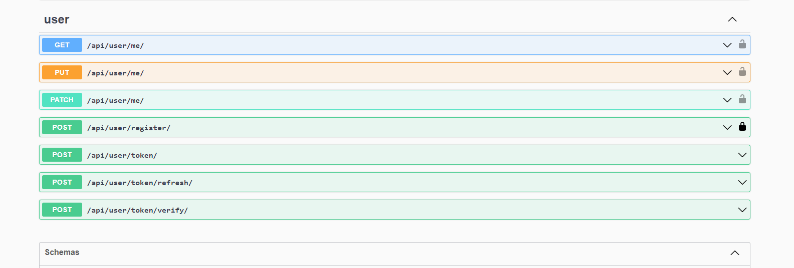
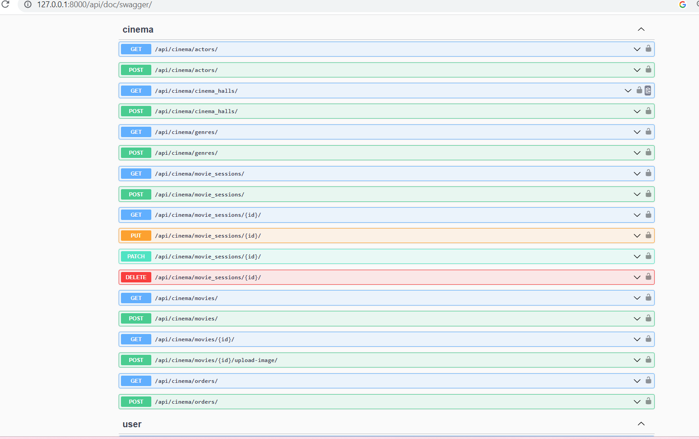

# Cinema Paradize
### Features
This is DRF project for managing your own cinema. It uses JWT authentication.
You can add movie, movie-session, cinema-halls.You could use filtering to find movie 
or movie session depends on title, genres, actors or date.
After  authentication user could create order and add preferable amount of ticket.
All available endpoins for user:

Enpoints for other features:

### How to run locally:

- Make sure you have Python 3 and pip installed on your system.
- Clone the repository using the command: 
```
git clone git@github.com:oksana-feshchenko/cinema-paradize.git
```

- Change directory:
```
cd cinema-paradize
```
- Create and activate virtual environment:
```
python -m venv venv
venv\Scripts\activate (on Windows)
source venv/bin/activate (on macOS)

```
- Install the required dependencies using the command:
```
pip install -r requirements.txt
```
- Set environmental variables:
```
 $env:DB_HOST = 'your db host name'
 $env:DB_NAME = 'your db name'
 $env:DB_USER = 'your db user name'
 $env:DB_PASSWORD =  'your db passoword'
 $env:DJANGO_SECRET_KEY =  'your secret key'
 $env:DJANGO_DEBUG = 'boolean'


```

- Set up the database by running the command: 
```
python manage.py migrate
```
- Create a superuser by running the command: 
```
python manage.py createsuperuser
```
 (this is optional, but you may want to create a superuser to access all functionality).
- Start the development server by running the command: 
```
python manage.py runserver
```


### Run with docker:
- Install docker.
- Run this commands
```
docker-compose build
docker compose up
```

- Open your browser and navigate to http://localhost:8000/ to verify that everything is working properly.

